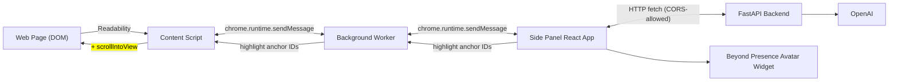
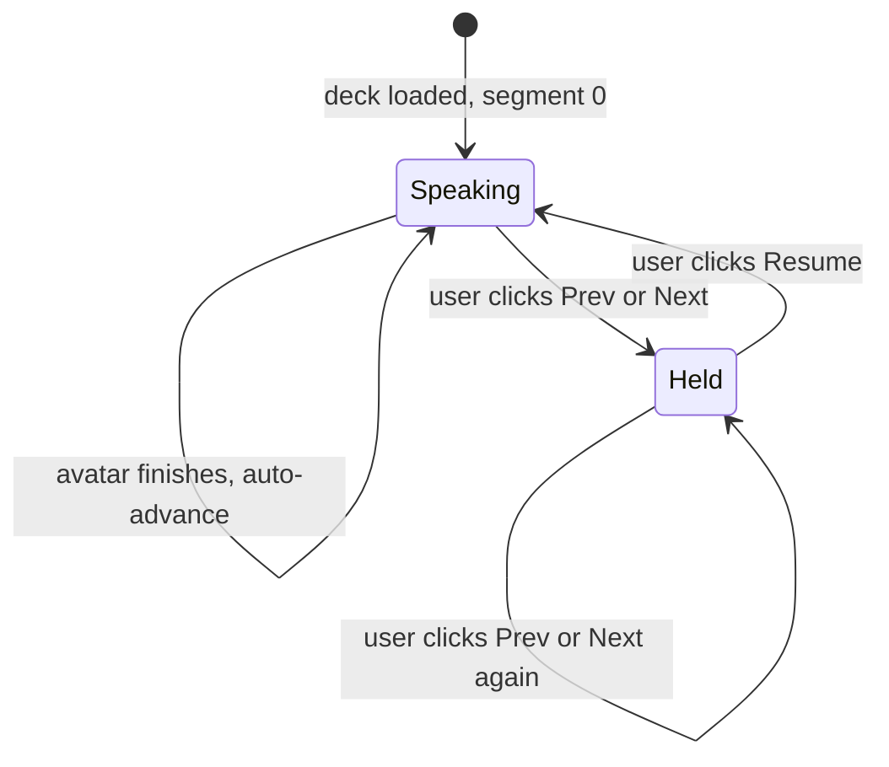

# tutor

A Chrome side-panel extension where a Beyond Presence avatar tutor teaches you
whatever web page you're on. Auto-reads the page, offers four teaching modes
(**Teach me**, **Summarise**, **Quiz me**, **Explain simply**), supports free
chat, and shows synced slides with notes that you can pause and rewind through
like a real lecture.

## Repository layout

- [`backend/`](backend/) — FastAPI service. OpenAI for chat + embeddings,
  numpy for in-memory retrieval. All endpoints are plain HTTP; the avatar's
  TTS is the streaming experience. See [`backend/README.md`](backend/README.md)
  for the build playbook.
- [`frontend/`](frontend/) — React + Vite + TypeScript side-panel UI. Same
  bundle ships inside the Chrome MV3 extension.
- `extension/` (planned) — MV3 manifest, background service worker, content
  script. Built alongside the frontend via `@crxjs/vite-plugin`.

## High-level architecture



Three message channels:

1. **Content script ↔ Background ↔ Side Panel** — `chrome.runtime` messages.
   The background worker is the relay; content scripts can't talk to side
   panels directly.
2. **Side Panel → Backend** — plain HTTP `fetch` calls. CORS allows
   `chrome-extension://*` and `http://localhost:*`.
3. **Side Panel ↔ Beyond Presence Avatar** — the BP SDK runs inside the
   panel's iframe; speech in/out is handled by their widget.

## Frontend integration contract

This is what the frontend team needs to implement against. All shapes are
final unless flagged otherwise.

### 1. Chrome extension message protocol

Messages between content script, background worker, and side panel use
`chrome.runtime.sendMessage` (or `chrome.tabs.sendMessage` from background to
content script in a specific tab). Each message has a `type` discriminator
and a payload.

#### Content script → Side panel (via background)

```ts
// emitted on side-panel "Activate on this page" click
{
  type: "page:extracted",
  payload: {
    title: string;        // document.title or Readability article.title
    url: string;          // current page URL
    blocks: Array<{
      id: string;         // stable ID like "b1", "b2", ... (counter)
      text: string;       // paragraph or section text
    }>;
  }
}
```

The content script keeps a `Map<string, HTMLElement>` from `id` to the actual
DOM node so it can resolve highlight commands later.

#### Side panel → Content script (via background)

```ts
// highlight one or more blocks in the live page
{
  type: "page:highlight",
  payload: { anchor_ids: string[] }
}

// clear all highlights
{
  type: "page:clearHighlights"
}
```

The content script wraps matching nodes in `<mark class="tutor-highlight">`,
calls `scrollIntoView({behavior:"smooth"})` on the first match, and clears on
the next `page:highlight` or `page:clearHighlights`.

### 2. Backend HTTP API

Base URL in dev: `http://localhost:8000`. All routes require JSON unless
noted; all responses are JSON.

#### `GET /health`

Liveness probe. Returns `{"ok": true}`.

#### `POST /session` — start a tutoring session

```ts
// request body
{
  title: string;
  url: string;
  blocks: Array<{ id: string; text: string }>;
}

// response
{
  session_id: string;        // UUID, used in all subsequent calls
  header_summary: string;    // one-line summary, displayed immediately in the panel
}
```

Server chunks + embeds the blocks and stores them in memory under
`session_id`. Sessions are NOT persisted — they live for as long as the
backend process runs.

#### `POST /mode` — fetch a teaching deck

```ts
// request body
{
  session_id: string;
  mode: "teach" | "summarise" | "quiz" | "explain_simply";
  lang: "en" | "hi" | "si" | "ta";   // default "en"
}

// response
{
  title: string;
  segments: Array<{
    id: string;                       // "s1", "s2", ...
    say: string;                      // what the avatar speaks
    slide: {
      title: string;
      bullets: string[];
    };
    anchor_ids: string[];             // block IDs to highlight on the live page
  }>;
}
```

The shape of `segments` is identical across all four modes. Only the content
of `slide.bullets` differs:

| Mode | `slide.bullets` content |
| --- | --- |
| `teach` | the key teaching points the avatar is currently saying |
| `summarise` | summary bullets for that section |
| `quiz` | the question text (avatar reads it; slide displays it) |
| `explain_simply` | simplified explanation bullets |

#### `POST /chat` — free-chat Q&A

```ts
// request body
{
  session_id: string;
  text: string;                      // user's typed (or speech-recognised) question
}

// response
{
  reply: string;                     // grounded in the page; what the avatar speaks
  highlight_anchor_ids: string[];    // blocks to highlight while the avatar speaks
}
```

No streaming protocol. The avatar's TTS is the perceived stream.

#### `POST /flashcards` — generate study cards

```ts
// request body
{ session_id: string; n?: number }   // default n=8

// response
Array<{
  q: string;
  a: string;
  source_chunk_id: string;           // block ID used to ground the card
}>
```

### 3. Slide deck navigation state machine

The side panel owns this state. The backend is not involved after the initial
`POST /mode`.



- **Initial load**: render `segments[0].slide`, hand `segments[0].say` to the
  avatar (it speaks), forward `segments[0].anchor_ids` as `page:highlight`.
- **Avatar finishes a segment** (BP `audio_complete` / `idle` event): increment
  `currentIndex`, render the new slide, speak the new `say`, send the new
  `page:highlight`.
- **User clicks Prev / Next**: call `pause()` on the BP session, change the
  visible slide to the navigated-to one, send the new `page:highlight`. The
  avatar **stays silent** ("hold") regardless of how many times the user
  navigates.
- **User clicks Resume**: speak the currently-visible slide's `say`. When that
  segment finishes, auto-advance resumes naturally.
- **Notes**: per-segment, panel-side state keyed by `segment.id`. In-memory
  for MVP; move to `chrome.storage.local` later if needed.

### 4. Beyond Presence avatar integration

The avatar widget is rendered inside the side panel. The frontend's
responsibilities:

- Embed the BP widget once on first session start; pass `BEY_AGENT_ID` from
  config.
- For every segment in a deck: `avatar.say(segments[i].say)`.
- On Prev/Next: `avatar.pause()` (or equivalent).
- On Resume: `avatar.say(segments[currentIndex].say)`.
- Subscribe to BP's `audio_complete` (or equivalent) event to drive
  auto-advance.

Voice chat with the avatar (Phase 4) routes through a separate
`POST /bey/llm` webhook on the backend; that path does not emit highlights to
the page (deliberate trade-off for MVP simplicity).

## Plan

The full product plan, priorities (MUST / SHOULD / NICE), demo script, and
phasing live in
[`.cursor/plans/interactive-wiki-tutor_1e075354.plan.md`](.cursor/plans/interactive-wiki-tutor_1e075354.plan.md).

## Status

Backend is at Step 4 of 10 (CORS configured; OpenAI smoke test passing). See
[`backend/README.md`](backend/README.md) for the playbook.
