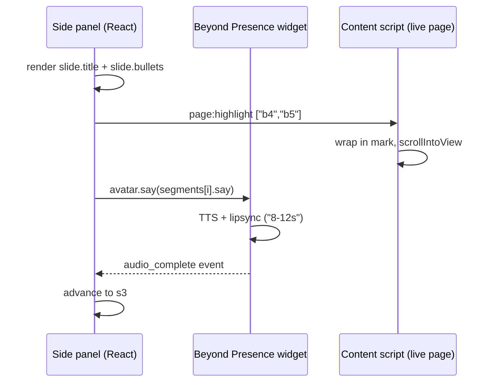
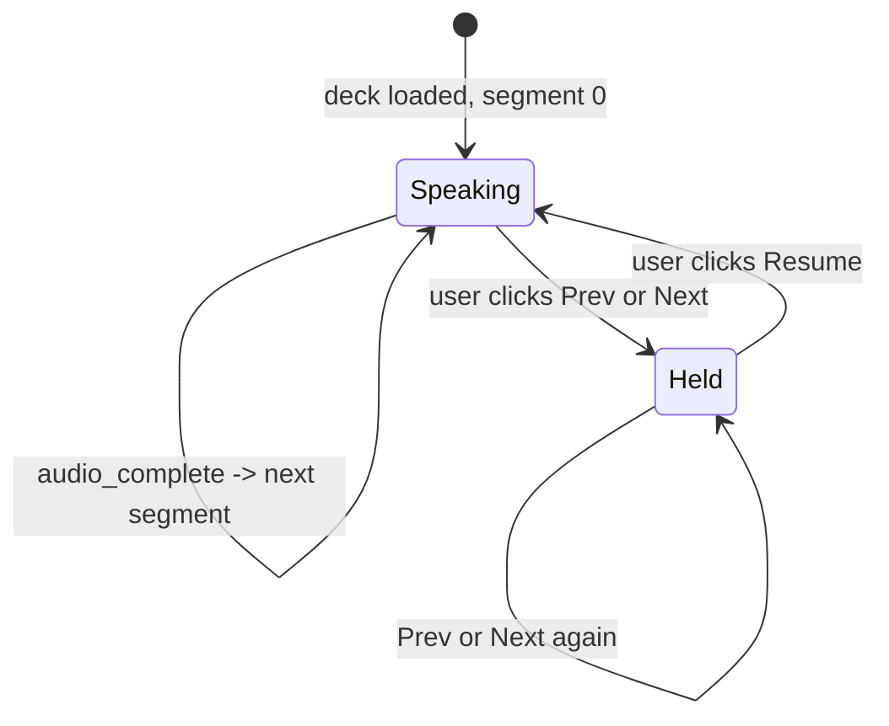

# Frontend Concepts — Deep Dive

Companion to [`README.md`](README.md). The README is the **spec** ("what
to build"). This file is the **conceptual scaffolding** ("why it works
this way") — the parts that confuse you the first time you stare at a
`/mode` response or wire up the avatar.

If you're picking up the frontend cold, read [`README.md`](README.md)
first, then come back here.

## 1. Three ID systems, three different lifetimes

A `/mode` response carries three layers of identifiers that look similar
but mean very different things. Mixing them up is the single most common
integration bug.

| Prefix | Lives in | Means | Lifetime |
| --- | --- | --- | --- |
| `b1`, `b2`, … | the page DOM (`data-tutor-id` attrs) | a paragraph (block) on the live web page | one page activation |
| `s1`, `s2`, … | a `Deck` (response from `POST /mode`) | one segment / slide of that deck | one `/mode` call |
| `c1`, `c2`, … | server memory only (RAG internals) | a chunk (group of consecutive blocks) | session lifetime; **never sent to frontend** |

Concretely:

- **`b*` IDs** are minted by the **content script** when it parses the
  page with Readability. The same content script tags the actual DOM
  elements with `data-tutor-id="b1"`. Every other layer references "this
  paragraph on the page" via these IDs.
- **`s*` IDs** are generated by the **LLM** inside `POST /mode` for one
  particular deck. Switching mode = a new deck = a fresh batch of `s*`
  IDs. They're what Prev / Next walks through, and they're the keys for
  per-segment notes.
- **`c*` IDs** are RAG bookkeeping. The frontend never sees them. Each
  chunk records which `b*` blocks it spans, so the LLM grounds its
  segments on chunks but cites the underlying `b*` IDs in `anchor_ids`.

### How they connect

```
Page DOM                 Server memory                   /mode response
┌────────┐               ┌──────────────┐                ┌──────────┐
│<p b1>..│ chunk_blocks  │ c1: [b1, b2] │   build_deck   │ s1       │
│<p b2>..│ ────────────► │              │ ─────────────► │   anchor │
│<p b3>..│               │ c2: [b3, b4] │                │   _ids:  │
│<p b4>..│               │              │                │   [b1,   │
│ ...    │               │ c3: [b5, b6] │                │    b2]   │
└────────┘               └──────────────┘                └──────────┘
                          (frontend never                  ↑
                           sees this layer)                │
                                                           s1 cites b1+b2
                                                           because it
                                                           grounded on c1
```

The frontend only ever traffics in `b*` and `s*`. `c*` is server-internal.

## 2. Three coordinated channels per segment

Every segment in a deck drives **three different UI surfaces in parallel**.
The LLM produces separate fields for each because each surface needs its
own format.

| Field | Goes to | Purpose | Format |
| --- | --- | --- | --- |
| `say` | Avatar's mouth (TTS) | spoken narration | conversational, full sentences, time-paced |
| `slide.title` + `slide.bullets` | Side-panel slide UI | scannable visual | short fragments, 3-5 bullets |
| `anchor_ids` | Live page (via content script) | highlight + auto-scroll | list of `b*` strings |

When the side panel switches to segment `s2`, **all three fire at the
same time**:



### The avatar never sees the slide or the anchors

Critical implementation point: **`avatar.say(...)` only consumes the
`say` string.** Don't pass it `slide.bullets` or `anchor_ids`. Why?

- Bullet style (`Biological process | Converts light energy | …`) reads
  robotically as TTS. The LLM wrote a separate `say` precisely so the
  voice sounds natural.
- Anchors are page coordinates; the avatar has no concept of the page.

Three channels, three different formats, one segment.

## 3. Beyond Presence integration: push, not pull

BP supports two integration shapes. We use the simpler one for everything
in Phase 1.

### Pattern A — Push (used by `/mode`, `/chat`, `/flashcards`)

```ts
const deck = await fetch("/mode", { ... }).then(r => r.json());
let i = 0;

function playSegment() {
  const seg = deck.segments[i];
  renderSlide(seg.slide);                  // panel UI
  sendHighlight(seg.anchor_ids);           // content script
  avatar.say(seg.say);                     // BP TTS
}

playSegment();

avatar.on("audio_complete", () => {
  i++;
  if (i < deck.segments.length) playSegment();
});
```

The backend pre-generates the entire script. The frontend pushes each
line to the avatar in turn. Simple, deterministic, easy to scrub.

### Pattern B — LLM webhook (planned for Phase 4 voice chat)

BP runs its own conversation loop and calls a backend webhook
(`POST /bey/llm`) every time the user speaks. The backend returns the
next utterance. Used when the avatar must react in real time to live
voice input.

**Not used by `/mode`, `/chat`, or `/flashcards`.** Those return
fully-formed scripts; the frontend just plays them. BP webhook only
kicks in when the user starts free-form voice chatting with the avatar.

## 4. Slide deck state machine

The side panel owns the "what segment are we on" state. The backend's job
ends after returning the deck.



| Trigger | What the panel does |
| --- | --- |
| Avatar `audio_complete` | `i++`. Render new slide. Send new highlight. `avatar.say(deck.segments[i].say)`. |
| Click **Next** while Speaking | `avatar.pause()`. Render slide `i+1`. Send new highlight. **Avatar stays silent.** |
| Click **Prev** while Speaking | Same — pause, navigate, silent hold. |
| Click **Next / Prev** while Held | Slide moves, highlight moves, **avatar stays silent**. |
| Click **Resume** | `avatar.say(deck.segments[i].say)`. Auto-advance resumes naturally on next `audio_complete`. |
| Exit mode | `avatar.pause()`. Send `page:clearHighlights`. |

The "hold while user navigates" rule means a learner can flip through
slides at their own pace without the avatar talking over them, and only
press Resume when they're ready to listen again.

## 5. End-to-end: from "user clicks Summarise" to "first words spoken"

```mermaid
sequenceDiagram
    participant User
    participant Panel as Side panel
    participant BE as Backend
    participant BP as BP avatar
    participant CS as Content script

    User->>Panel: clicks "Summarise"
    Panel->>BE: POST /mode {session_id, mode, lang}
    Note over BE: pack chunks → gpt-4o-mini → validate Deck
    BE-->>Panel: Deck { title, segments: [s1..s5] }
    Panel->>Panel: render segments[0].slide
    Panel->>CS: page:highlight segments[0].anchor_ids
    CS->>CS: wrap in mark, scroll
    Panel->>BP: avatar.say(segments[0].say)
    BP-->>User: speaks "8-12s"
    BP-->>Panel: audio_complete
    Panel->>Panel: i++; same dance for s2
```

End-to-end latency from click to first word: **~5-15 seconds** (the
cost of one `gpt-4o-mini` call + BP's TTS startup). Avatar speech itself
runs in real time after that.

## 6. Per-segment notes (panel-only, never sent to backend)

Notes are panel-side state. Keep a `Map<string, string>` keyed by
`segment.id`:

```ts
const notes = new Map<string, string>();
// segment s2 user typed "review chlorophyll later"
notes.set("s2", "review chlorophyll later");
```

The backend doesn't know about notes and doesn't need to. Persist via
`chrome.storage.local` if you want them to survive page reloads.

**Why key by `segment.id` and not `segment.say`?** Because the segment
ID is stable for the lifetime of that deck. If the user navigates away
and comes back to the same deck, notes line up.

**What if the user switches mode?** Different deck, different `s*` IDs.
Notes for the previous mode are still in the Map but inactive. Two
sensible behaviours:

- Show "you have notes from your earlier Summarise session" UI, OR
- Clear notes on mode change.

Product call, not a contract issue. Either is fine.

## 7. Quick reference — which IDs go where

When implementing a new piece, always know which layer you're operating
on:

| Where you are | What IDs you traffic in |
| --- | --- |
| Content script | `b*` (paragraph IDs) |
| Side panel slide UI | `s*` (segment IDs), `slide.title`, `slide.bullets` |
| Avatar wrapper | `say` strings only |
| Highlight messages (`page:highlight`) | `b*` (anchor_ids) |
| Backend client (`fetch` wrapper) | `session_id` (32-char hex) |
| Notes store | `s*` (segment IDs) |

The minute you see code mixing these — passing `s1` to an `avatar.say`,
sending a `c2` to the content script, keying notes by `b*` — there's a
layering bug.

## 8. Things the backend does NOT do (so the frontend has to)

The backend is a stateless RPC over an in-memory session store. It
deliberately leaves these to the frontend:

- **Tracking which segment is currently visible.** The deck is returned
  once; from there, advancing through segments is panel-side state.
- **Pause / resume / scrub.** Backend has no concept of "now playing".
- **Notes persistence.** Backend never sees notes.
- **Highlight management on the live page.** Backend just returns
  `anchor_ids`; the content script does the actual `<mark>` + scroll.
- **Session lifecycle UI.** Backend doesn't know when a session is
  "done"; it just keeps the chunks in memory until uvicorn restarts.

This split is deliberate — it keeps the backend a pure transformation
layer (page in → deck out) and lets the frontend own all the realtime,
stateful, user-perceived behaviour.
