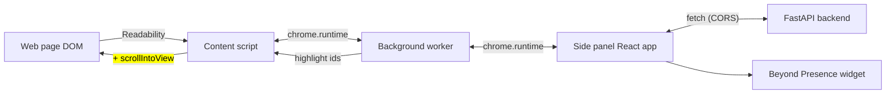
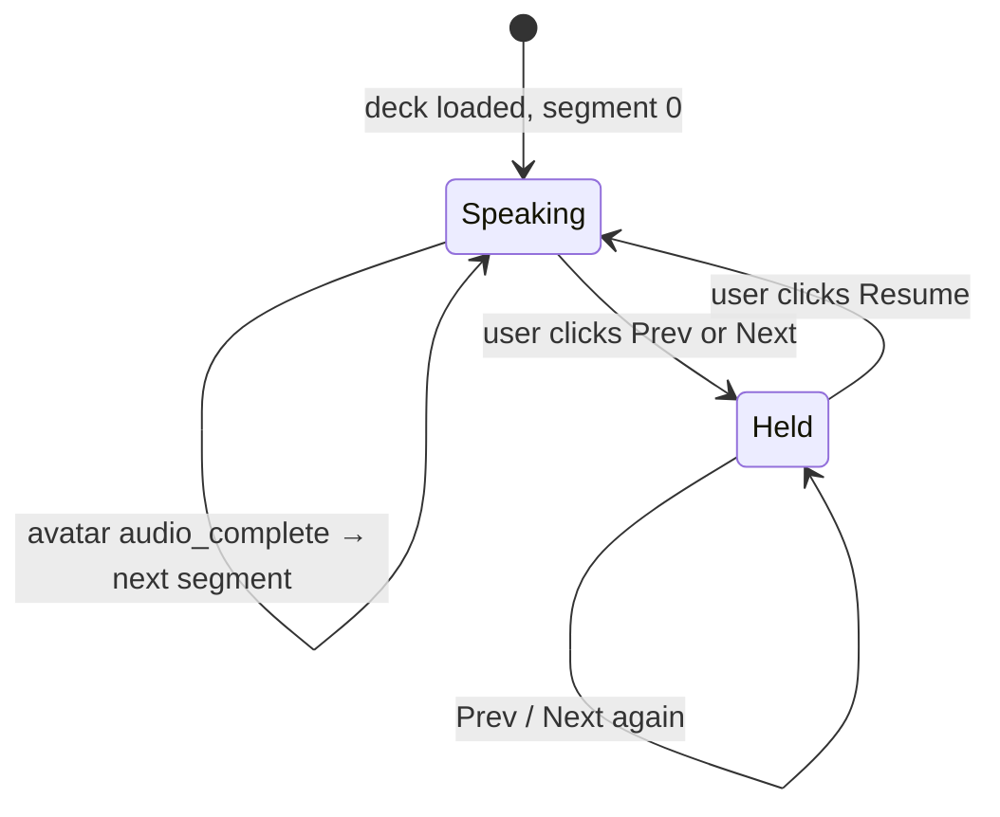

# Tutor Frontend

The user-facing side of the Tutor product: a Chrome MV3 extension that opens
a side panel with a Beyond Presence avatar, syncs slides with the avatar's
speech, and highlights paragraphs on the live page as the avatar walks
through them.

> **Backend / API status:** [`../backend/README.md`](../backend/README.md)
> **Backend + frontend overview:** [`../BACKEND_AND_FRONTEND_GUIDE.md`](../BACKEND_AND_FRONTEND_GUIDE.md)
> **Full product plan + phasing:** [`../.cursor/plans/interactive-wiki-tutor_1e075354.plan.md`](../.cursor/plans/interactive-wiki-tutor_1e075354.plan.md)
> **Canonical contract:** [`../README.md`](../README.md) — this file repeats
> the frontend-relevant parts so you don't have to bounce between docs.
> **Frontend build playbook (steps 1–13):** [`BUILD_PLAYBOOK.md`](BUILD_PLAYBOOK.md)
> **Concepts deep-dive:** [`CONCEPTS.md`](CONCEPTS.md) — the "why does it
> work this way" companion to this spec (ID systems, the three channels per
> segment, BP push vs pull, slide state machine in code).

## What you're building

A Chrome MV3 extension with three runtime pieces:

1. **Content script** — runs inside every page. Uses Mozilla's
   [Readability.js](https://github.com/mozilla/readability) to extract clean
   article text into ordered "blocks" with stable IDs, tags the live DOM
   with `data-tutor-id` markers, and accepts highlight commands.
2. **Background service worker** — relays messages between the content
   script and the side panel (Chrome doesn't let them talk directly).
3. **Side panel** — React app. Renders the avatar widget (Beyond Presence),
   the slide deck, mode buttons, the chat box, and per-segment notes. Calls
   the FastAPI backend over HTTP.



## Page extraction (content script)

When the user clicks "Activate on this page" in the side panel, the content
script does:

1. `document.title` → `title`
2. `window.location.href` → `url`
3. `new Readability(document.cloneNode(true)).parse()` → cleaned article HTML
4. Split the cleaned content into paragraphs / headings, assign each `b1`,
   `b2`, … in order, **and tag the original DOM elements** with
   `data-tutor-id="b1"` etc. Keep an in-memory `Map<string, HTMLElement>`
   from id → node for the lifetime of the page so highlight commands can
   resolve back to the actual DOM.
5. Send the result to the side panel (via the background worker):

```ts
{
  type: "page:extracted",
  payload: {
    title: string;
    url: string;
    blocks: Array<{ id: string; text: string }>;
  }
}
```

The `id`s are **assigned by the content script** — the backend never
invents them, only echoes them back as `anchor_ids` so highlights are
always round-trippable.

### Sites that work well

Readability is the same library Firefox Reader View uses, so the rule of
thumb is **"if Reader View shows the page cleanly, our extension will
too."**

| Tier | Sites |
| --- | --- |
| Best demo material | Wikipedia, MDN, Stanford Encyclopedia of Philosophy, Britannica, mainstream news (BBC, NYT, Guardian, Atlantic, Wired), most blogs (Substack, Medium, Ghost, dev.to), arXiv abstract pages, project docs (docs.python.org, MDN, FastAPI, Django, etc.) |
| Works with caveats | Wikipedia mobile (sections collapsed), Reddit threads (top post fine, comments are one blob), public Notion pages, sites with cookie banners |
| Hard / needs adapters | YouTube (use transcript API instead), Twitter / X (SPA, content rendered post-load), LMS dashboards (Canvas, Moodle, Blackboard), Google Docs (renders to `<canvas>`, no DOM text) |
| Out of scope for HTML path | PDFs (separate PDF.js path — see plan Phase 2), `chrome://` and `chrome-extension://` URLs |

For the MVP demo, **lead with Wikipedia and MDN.** They're paragraph-rich,
public, and topic-diverse.

## Message protocol (Chrome runtime)

All messages have a `type` discriminator. Use `chrome.runtime.sendMessage`
from the side panel and content script; use `chrome.tabs.sendMessage` from
the background worker when targeting a specific tab.

### Content script → side panel (via background)

```ts
{ type: "page:extracted", payload: { title, url, blocks } }
```

### Side panel → content script (via background)

```ts
{ type: "page:highlight", payload: { anchor_ids: string[] } }
{ type: "page:clearHighlights" }
```

The content script reacts by:

- Wrapping each matching `[data-tutor-id]` in
  `<mark class="tutor-highlight">`.
- Calling `scrollIntoView({ behavior: "smooth", block: "center" })` on the
  first match.
- Clearing all marks on the next `page:highlight` or
  `page:clearHighlights`.

## Backend HTTP API

Base URL in dev: `http://localhost:8000`. CORS already accepts
`chrome-extension://*` and `http://localhost:*`, so no proxy needed.
Swagger UI lives at http://localhost:8000/docs for manual exercising
before the frontend is wired up.

### `POST /session` — start a tutoring session

```ts
// request
{ title: string; url: string; blocks: Array<{ id: string; text: string }> }

// response
{ session_id: string; header_summary: string }
```

Call this **once** when the user activates the tutor on a page. Display
`header_summary` immediately so the panel feels alive while the user picks
a mode. Sessions are in-memory; restarting the backend wipes them.

### `POST /mode` — fetch a teaching deck

```ts
// request
{
  session_id: string;
  mode: "teach" | "summarise" | "quiz" | "explain_simply";
  lang: "en" | "hi" | "si" | "ta";   // default "en"
}

// response
{
  title: string;
  segments: Array<{
    id: string;                 // "s1", "s2", ...
    say: string;                // what the avatar speaks
    slide: { title: string; bullets: string[] };
    anchor_ids: string[];       // block IDs to highlight during this segment
  }>;
}
```

Shape is identical for all four modes. Only `slide.bullets` content
differs:

| Mode | `slide.bullets` |
| --- | --- |
| `teach` | key teaching points the avatar is currently saying |
| `summarise` | summary bullets for that section |
| `quiz` | the question text (avatar reads it; slide displays it) |
| `explain_simply` | simplified explanation bullets |

### `POST /chat` — free-text Q&A

```ts
// request
{ session_id: string; text: string }

// response
{ reply: string; highlight_anchor_ids: string[] }
```

Drop `reply` into `avatar.say()`; forward `highlight_anchor_ids` as
`page:highlight`. There is no streaming protocol on the wire — the avatar's
TTS is the perceived stream.

### `POST /flashcards` — generate study cards

```ts
// request
{ session_id: string; n?: number }   // default 8

// response
Array<{ q: string; a: string; source_chunk_id: string }>
```

### `GET /health`

Liveness probe; `{ ok: true }`.

## Slide deck state machine

The side panel owns this state. The backend is not involved after the
initial `POST /mode`.



| Trigger | What the panel does |
| --- | --- |
| Deck loaded | Render `segments[0].slide`. `avatar.say(segments[0].say)`. Send `page:highlight` for `segments[0].anchor_ids`. |
| Avatar `audio_complete` | `currentIndex++`. Render new slide. `avatar.say(...)`. New highlight. |
| User clicks Prev / Next | `avatar.pause()`. Render the navigated slide. New highlight. **Avatar stays silent** — does not auto-resume on further nav. |
| User clicks Resume | `avatar.say(segments[currentIndex].say)`. Auto-advance resumes naturally on next `audio_complete`. |
| User exits session | `avatar.pause()`. Send `page:clearHighlights`. |

Per-segment notes are panel-side state keyed by `segment.id`. In-memory for
MVP; move to `chrome.storage.local` later if persistence is needed.

## Beyond Presence avatar integration

The BP widget runs inside the side-panel iframe. Frontend responsibilities:

- Initialise once on first session, with `BEY_AGENT_ID` from config.
- For every segment: `avatar.say(segments[i].say)`.
- On Prev / Next: `avatar.pause()`.
- On Resume: `avatar.say(segments[currentIndex].say)`.
- Subscribe to `audio_complete` (or BP's equivalent idle event) to drive
  auto-advance.
- Voice chat with the avatar is **Phase 4** in the plan; it routes through
  a separate backend webhook (`POST /bey/llm`) that intentionally does not
  emit highlights, to keep the MVP simple.

## Repository layout (target)

```
frontend/
├── dist/                   # `npm run build` output — Load unpacked here
├── public/                 # static assets copied into dist (SVG placeholders)
├── src/
│   ├── sidepanel/          # MV3 side panel React entry + App.tsx
│   ├── background/         # service worker (side panel open behavior)
│   └── content/            # content script stub (Step 4 adds Readability)
├── manifest.config.ts      # MV3 manifest (@crxjs/vite-plugin)
├── vite.config.ts
├── package.json
├── BUILD_PLAYBOOK.md       # step-by-step journal (this spec expands here)
└── README.md               # this file
```

Recommended stack (per [root README](../README.md)): **React + Vite +
TypeScript + [@crxjs/vite-plugin](https://crxjs.dev/vite-plugin)** — one
build pipeline produces the side panel, content script, and background
worker as a single Chrome-loadable bundle (**[`BUILD_PLAYBOOK.md`](BUILD_PLAYBOOK.md) Step 1 implemented**).

> **Historical:** This folder previously used `create-next-app`; it has been
> replaced by **Vite + crxjs** for MV3 (`npm run build` → **`dist/`**).

## Dependencies you'll need

- [`@mozilla/readability`](https://github.com/mozilla/readability) — content
  extraction
- [`@crxjs/vite-plugin`](https://crxjs.dev/vite-plugin) — MV3 build pipeline
- Beyond Presence JS SDK — confirm package name once keys are in hand
- `react`, `react-dom`
- `zod` (optional but recommended) — runtime-validate backend responses
  against the contract above so wire-shape regressions fail loudly
- A tiny fetch wrapper, or just `fetch` directly

## Local dev

Once the Vite + crxjs setup exists:

```bash
cd frontend
npm install
npm run build          # produces dist/ — load this folder unpacked
# optional hot reload during development:
npm run dev
```

In Chrome: `chrome://extensions` → toggle **Developer mode** → click **Load
unpacked** → select **`frontend/dist/`**. The extension ID will be displayed;
the backend's CORS already accepts any `chrome-extension://*` origin, so
no further config is required.

Reload the extension after each `npm run build` when not using `npm run dev`.

The backend must be running separately:

```bash
cd backend
uv run uvicorn main:app --reload    # → http://localhost:8000
```

http://localhost:8000/docs is the Swagger UI — exercise the API there to
sanity-check shapes before wiring them into the panel.

## Status

- **Backend:** playbook **10/10** — `/session`, `/mode`, `/chat`, `/flashcards`.
  See [`../backend/README.md`](../backend/README.md) and
  [`../BACKEND_AND_FRONTEND_GUIDE.md`](../BACKEND_AND_FRONTEND_GUIDE.md).
- **Frontend:** **Step 1 done** — Vite + `@crxjs/vite-plugin`; `npm run build` →
  **`dist/`** MV3 bundle with side panel + stub background + stub content script.
  Follow [`BUILD_PLAYBOOK.md`](BUILD_PLAYBOOK.md) for Steps 2–13.

### Suggested first slice (smallest demoable thing)

Build in this order so each step produces something visible:

1. **Manifest + empty side panel** — opens, shows "Hello".
2. **Content script extraction** — logs the `blocks` array to the console
   when activated.
3. **Wire `POST /session`** — side panel calls it, displays
   `header_summary` at the top.
4. **Mode buttons + `POST /mode`** — render slides as plain HTML, no
   avatar yet, no highlighting.
5. **Highlighting round trip** — side panel sends `page:highlight`,
   content script wraps `<mark>`s and scrolls.
6. **Beyond Presence widget** — replace the plain text with the avatar
   speaking each segment; hook up the state machine above.
7. **`POST /chat`** — free-text question box that updates highlights and
   makes the avatar speak the reply.

Steps 1–4 are demoable without any avatar API keys, which makes them ideal
to land first.
